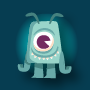
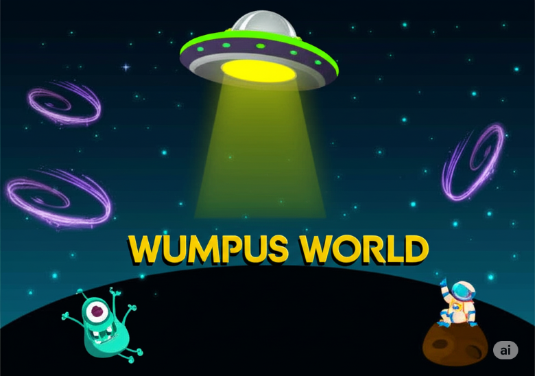
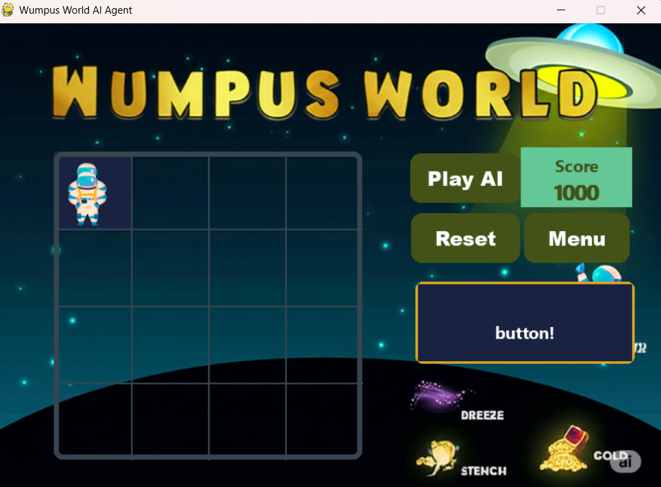
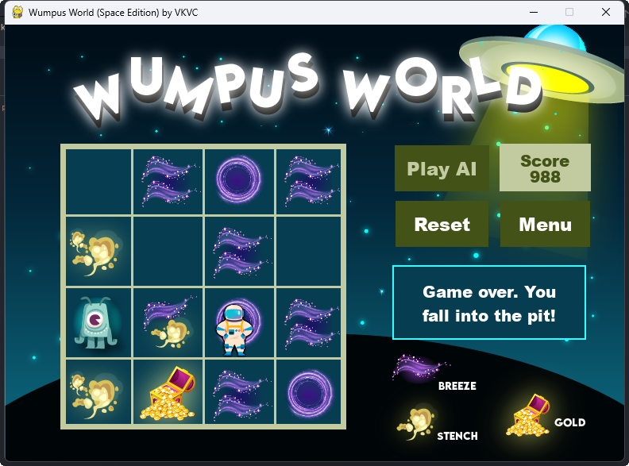
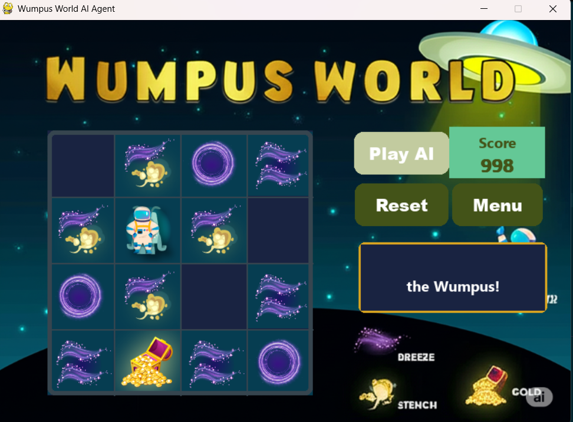
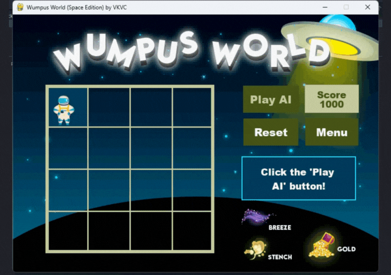

# ✨Wumpus World Game

The Wumpus World is a classic environment used in artificial intelligence research and education. In this game, an intelligent agent navigates a 4x4 grid of interconnected rooms, searching for a piece of gold while avoiding deadly hazards. These hazards include bottomless pits that trap the agent instantly and a fearsome creature called the Wumpus, which will kill the agent if they enter its room. The agent starts at the lower-left corner of the grid, cell [1,1], and must use limited sensory input to make decisions and achieve its goal.

This version of Wumpus World is reimagined as a space-themed exploration mission, where the agent explores a hostile alien cave system in search of treasure.

View full project documentation here: [Wumpus World AI Agent - DeepWiki](https://deepwiki.com/Getachew0557/Wumpus-world-AI-agent)

## ⚙️ Properties of the World
The Wumpus World environment is:

- Partially Observable: The agent can only sense limited information about adjacent cells, making the environment uncertain.

- Deterministic: The outcome of the agent’s actions is predictable and consistent.

- Sequential: The agent must make a series of dependent decisions over time.

- Static: The environment does not change while the agent is exploring; hazards remain in fixed locations.

- Discrete: The world is divided into a finite number of grid cells.

- Single-Agent: The agent operates alone; the Wumpus and pits are passive environmental features, not active agents.

.

## 🧠 PEAS Description
- **Performance Measure**: The agent receives a reward of +1000 points for successfully retrieving the gold and climbing out of the cave. It receives a −1000 point penalty if it falls into a pit or is eaten by the Wumpus. Every move costs −1 point, and using the arrow costs −10 points.

- **Environment**: The world is a 4x4 grid representing a cave. The agent starts in cell [1,1] facing right. The Wumpus, pits, and gold are placed randomly throughout the grid, except for the starting cell.

- **Actuators**: The agent can move forward, turn left or right (by 90 degrees), grab the gold, shoot an arrow in the direction it is facing, and climb out of the cave (only from the starting square).

- **Sensors**: The agent in the Wumpus World perceives five types of sensory information that help it infer what lies beyond its immediate surroundings. A stench is perceived when the agent is in a cell adjacent to the Wumpus, indicating potential danger nearby. A breeze is felt in any cell adjacent to a bottomless pit, warning the agent of a deadly drop. When the agent enters a cell containing the gold, it perceives a glitter, signaling that the treasure is within reach. If the agent attempts to move forward into a wall, it experiences a bump, letting it know that movement in that direction is blocked. Finally, if the Wumpus is killed by the agent’s arrow, a loud scream echoes through the cave, confirming that the threat has been neutralized.

| Gold | Wumpus | Pit | Stench | Breeze |
| :---: | :---: | :---: | :---: | :---: |
|  |  |  |  |  |


## 🎯 Objective
The main objective of the agent is to safely retrieve the gold and return to the starting cell [1,1]. To do this, the agent must explore the cave, use perceptual inputs to infer safe paths, avoid hazards, and act strategically—possibly even using its single arrow to kill the Wumpus if necessary. Success is only achieved if the agent climbs out of the cave alive with the gold.


## How to Play

1. **Game Phases**:
   - **Setup**: The game randomly generates the cave layout, placing the wumpus, pits, and gold.
   - **AI Agent Move**: The AI agent makes a move based on its perception of the environment and the knowledge base it maintains.
   - **Game Over**: The game ends if you are eaten by the wumpus, fall into a pit, or successfully retrieve the gold.


2. **Scoring System**:
    - **`Moving`**: -1 point per move
    - **`Use of arrows`**: -10 points
    - **`Retrieving gold`**: +1000 points
    - **`Killing a Wumpus`**: +2000 points
  
   
3. **Winning Condition**:
   - Retrieve the gold and make it back to the starting position.
     

## How to Run

1. Clone this repository.  `https://github.com/Getachew0557/Wumpus-world-AI-agent.git`
2. Navigate to the directory containing the game files.
3. Run the following command:

```bash
python main.py
```


## Dependencies
- Python 3.x
- Pygame 2.5.x


## Screenshots

Here are some screenshots of the game:

### Title Screen



### Main Game
#### Starting Phase


<!-- #### Ending Phases
**Fall into Pit**



**Eaten by Wumpus**



**Retreiving Gold**

 -->


---


